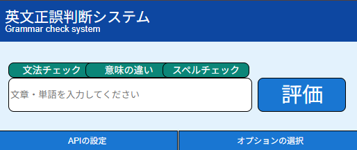

# English Check - 英文正誤判断システム

Google Gemini APIを活用したChrome拡張機能で、英文の正誤判断、単語の意味の違い、スペルチェックを行います。

## デモ


## 🌟 機能

### 1. 文節チェック（Grammar Check）
入力された英文の文法的な正しさを判断し、間違っている場合は修正案を提示します。

### 2. 意味の違いチェック（Meaning Check）
複数の英単語間の意味の違いを分析し、それぞれの単語の意味と使い分けを説明します。

### 3. スペルチェック（Spell Check）
英文のスペルミスを検出し、正しいスペルへの修正案を提示します。

## 🚀 インストール方法

### 1. リポジトリのクローン
```bash
git clone https://github.com/your-username/English_cheaker-by-Google-extension.git
```

### 2. Chrome拡張機能として読み込み
1. Chromeブラウザで `chrome://extensions/` を開く
2. 右上の「デベロッパーモード」を有効にする
3. 「パッケージ化されていない拡張機能を読み込む」をクリック
4. クローンしたフォルダを選択

### 3. Google Gemini API キーの設定
1. [Google AI Studio](https://aistudio.google.com/app/apikey) でAPIキーを取得
2. 拡張機能のポップアップから「APIの設定」をクリック
3. 取得したAPIキーを入力して保存
4. 「テスト」ボタンで接続確認

## 📖 使い方

1. Chromeツールバーの拡張機能アイコンをクリック
2. テキストボックスに英文または英単語を入力
3. チェックしたい項目を選択：
   - **文節チェック**: 文法の正誤を判断
   - **意味の違い**: 複数単語の意味を比較
   - **スペルチェック**: スペルミスを検出
4. 「評価」ボタンをクリック
5. 結果画面で判断結果と修正案を確認

## 🛠️ 技術仕様

### 使用技術
- **Chrome Extension Manifest V3**
- **Google Gemini API** (gemini-2.0-flash)
- **JavaScript (ES6+)**
- **HTML5 / CSS3**

### ディレクトリ構成
```
English_cheaker-by-Google-extension/
├── manifest.json          # 拡張機能の設定ファイル
├── README.md              # このファイル
└── src/
    ├── background.js      # バックグラウンドスクリプト（API通信処理）
    ├── apitest.py         # APIテスト用スクリプト
    ├── api_setting/       # API設定画面
    │   ├── api_setting.html
    │   ├── api_setting.js
    │   └── style.css
    ├── option_setting/    # オプション設定画面
    │   ├── option_setting.html
    │   ├── option_setting.js
    │   └── style.css
    ├── order/             # 結果表示画面
    │   ├── order.html
    │   ├── order.js
    │   └── style.css
    └── popup/             # メインポップアップ画面
        ├── popup.html
        ├── popup.js
        ├── button_function.js
        ├── test.js
        └── style.css
```

### 権限
- `storage`: APIキーとエンドポイント設定の保存
- `contextMenus`: コンテキストメニュー機能

## ⚙️ 設定

### エンドポイント
デフォルトでは `gemini-2.0-flash` モデルを使用します。API設定画面で変更可能です。

### APIレスポンス形式
```json
{
    "judgment": "正しい または 間違っている",
    "reason": "判断理由",
    "correction_suggestion": "修正案"
}
```

## 🔧 開発者向け情報

### ローカル開発
1. コードを変更後、`chrome://extensions/` で拡張機能をリロード
2. 開発者ツール（F12）でコンソールログを確認

### デバッグ
- バックグラウンドスクリプト: 拡張機能ページの「Service Worker」をクリック
- ポップアップ: ポップアップを右クリック →「検証」

## 📝 ライセンス

MIT License

## 🤝 貢献

プルリクエストやイシューは歓迎します！

## 📧 お問い合わせ

質問やフィードバックがあれば、Issueを作成してください。
